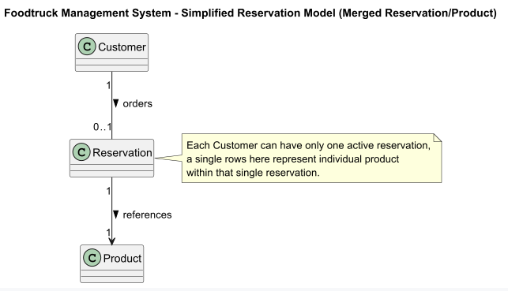
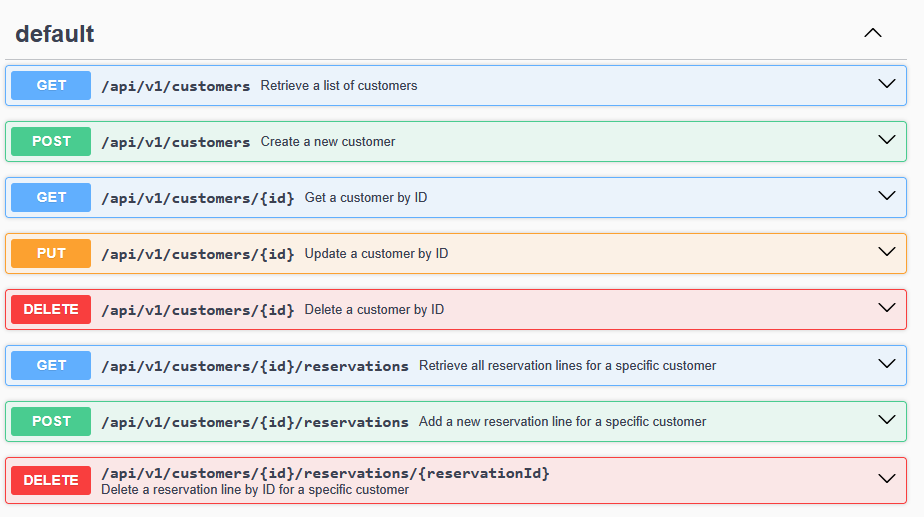

# Evaluations

## Modalités

Vous recevrez le projet via GitHub. Un simple clone du dépôt est requis.

⚠️ Ne créez pas de fork et ne publiez pas votre code pendant toute la durée de l’évaluation.

||||
|:--|:--|:--|
|Temps à disposition|2 périodes|
|Travail collaboratif|interdit, y compris IA|

### Livraison

Créez une archive compressée (.zip uniquement) du dossier ms-customers, en excluant les éléments suivants :

* le répertoire node_modules
* le fichier customers.sqlite

Nommez l’archive selon le format suivant :

```I321-<NOMDEFAMILLE>``` (utilisez exactement le(s) même(s) nom(s) que sur l’intranet)

Transmettez ensuite cette archive à l’enseignant via un message privé sur Microsoft Teams.

Assurez-vous que le microservice remis soit exécutable (“runnable”).

## Introduction

Ce document constitue un mini cahier des charges décrivant les différents cas d’utilisation que vous devez être en mesure de valider.

Pour chaque tâche, vous trouverez :

* les requêtes à exécuter,
* ainsi que le résultat attendu.

⚠️ Les retours “hard codés” en JSON, sans implémentation réelle de la logique métier, ne seront évidemment pas pris en compte.

Respectez scrupuleusement l’architecture fournie et appliquez les bonnes pratiques abordées en classe.

La qualité du code est aussi importante que la fonctionnalité : soignez votre travail.

## Contexte

Le projet réalisé en classe a été légèrement ajusté (corrections mineures de syntaxe, suppression de commentaires inutiles), mais la logique générale reste inchangée.

⚠️ Vous ne devez ni modifier ni altérer le code des microservices products et product-items.

Ce cahier des charges concerne exclusivement le nouveau microservice customers.

Cette nouvelle fonctionnalité est déjà implémentée à environ 70 % — votre tâche consiste à finaliser son développement.

Pour vous guider dans l’implémentation, notez qu’un client ne peut posséder qu’une seule réservation.
Afin de vous simplifier un peu le travail, le système n'accepte qu'une seule réservation par client, et cette même 
réservation ne contient qu'un produit.



## Prise en main du projet

* clonez le dépôt en local
* pour chaque microservice
  * résolvez les dépendences (`npm install`)
  * lancez chaque microservice  (`npm run dev`)

Lancer le swagger pour "ms-customer".



## Persistence de données

### Initialisation
Des données sont injectées (seed) dans les trois microservices à leur lancement si la base de données n'est pas présente.

### Réinitalisation
* stopper le microservice concerné
* supprimer les fichiers .sqlite
* relancer le microservice

## Cahier des charges

Vous découvrirez ci-dessous le détail de chacune des tâches à réaliser.

Note : n'omettez pas la lecture de la documentation du Swagger (qui est à jour) !

---

# Tâche 001 - new feature - Suppression d'un client existant

La requête à réaliser:

```curl
curl -X 'DELETE' \
  'http://localhost:3002/api/v1/customers/1' \
  -H 'accept: */*'
```

Résultat actuel:

```curl
Code 500

{
  "error": "SQLITE_ERROR: no such table: customer"
}
```

Résultat à obtenir

La ressource doit avoir été supprimée de la base de données.
A noter que le client "1" dispose d'une réservation.
Elle doit également être supprimée.

**response header**

```curl
Code 204

connection: keep-alive 
 date: Mon,27 Oct 2025 13:04:19 GMT 
 keep-alive: timeout=5 
 x-powered-by: Express 
```


---

# Tâche 002 - bug fix - Remplacer un client existant

La route dédiée au remplacement d'un client est déjà fonctionnelle.
Votre travail commence au niveau du contrôleur.

La requête à réaliser (chgt de nom de famille):

```curl
curl -X 'PUT' \
  'http://localhost:3002/api/v1/customers/3' \
  -H 'accept: */*' \
  -H 'Content-Type: application/json' \
  -d '{
    "name": "Himmel",
    "firstname": "Sophia",
    "phoneNumber": "+1-784-336-8217",
    "emailAddress": "sophia.himmel@mail.com"
}'
```

Résultat actuel:

```curl
Code 500

{
  "error": "CustomerService.update is not a function"
}
```

Résultat à obtenir (response body):

```curl
Code 200

{
  "id": "3",
  "name": "Himmel",
  "firstname": "Sophia",
  "phoneNumber": "+1-784-336-8217",
  "emailAddress": "sophia.himmel@mail.com"
}
```

---

# Tâche 003 - new feature - Afficher la réservation d'un client

La requête à réaliser:

```curl
curl -X 'GET' \
  'http://localhost:3002/api/v1/customers/4/reservations' \
  -H 'accept: */*'
```

Résultat actuel:

Après l'envoi de la requête, le serveur "crash".

```curl
Undocumented error

TypeError: NetworkError when attempting to fetch resource.
```

Résultat à obtenir (response body):

```curl
[
  {
    "id": 4,
    "customer_id": 4,
    "product_id": 8,
    "quantity": 2,
    "created_at": "2025-10-27 13:22:23",
    "updated_at": "2025-10-27 13:22:23"
  }
]
```


## Grille d'évaluation

| Critères  | Points Max |Points obtenus| Commentaires |
|:----------|:-----------|:-|:------------|
| Livrable  | 3pts       ||             |
| Tâche 001 | 3pts       ||             |
| Tâche 002 | 5pts       ||             |
| Tâche 003 | 4pts       ||             |

### Détails
Chaque tâche doit avoir été correctement traitée et répondre pleinement aux besoins exprimés. Le code existant doit avoir été modifié et/ou produit dans la mesure minimale nécessaire pour atteindre la solution. Les pratiques en vigueur dans le projet doivent être respectées.

### Barème

(Nombredepointsobtenus/Nombredepointsmaximum)×5 + 1

Pondération :
Cette évaluation compte pour 50 % de la note finale du module.
